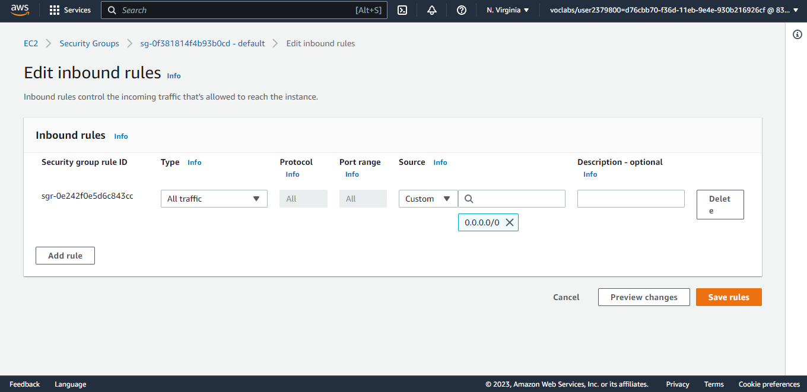

# Infrastructure Description

## **Okay in this file we will translate the diagram into actual steps**

---
### Now we discuss in Architecture Diagram

## **RDS FIRST**
---
### 1. Go to RDS in AWS and Create database

---
### 2.Create database with this settings 

---
### 3.Wait it be available

---
### 4.Go to Security Group

### 5.And Edit inbound rules to 0.0.0.0/0 to be public

## **FIRST : RDS**
---
### 1. Go to RDS in AWS and Create database

---
### 2.Create database with this settings 

---
### 3.Wait it be available

---
### 4.Go to Security Group

### 5.And Edit inbound rules to 0.0.0.0/0 to be public

## **SECOND : Elastic Beanstalk**
---
### 1. Go to Elastic Beanstalk in AWS and Create Applications

---
### 2.Then Create Environment Variable

---
### 3.Wait it be available and check health and website link

---
### 4.Then after deploy server solve all errors that will face you and check logs after deploy

## **THIRD : S3 Bucket**
---
### 1. Go to S3 Bucket in AWS and Create bucket

---
### 2.Then Upload frontend files to the bucket and edit website to generate endpoint link

---
### 3.Open endpoint link to check that website is working

---
### 4.Then after deploy server solve all errors that will face you and check logs after deploy

