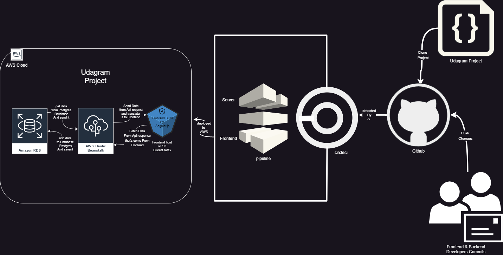
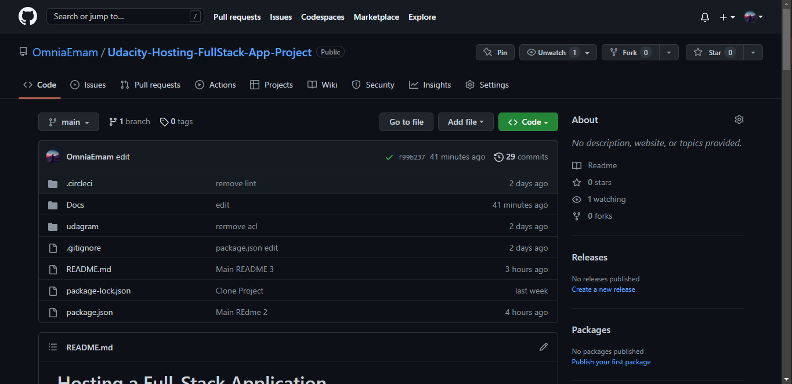
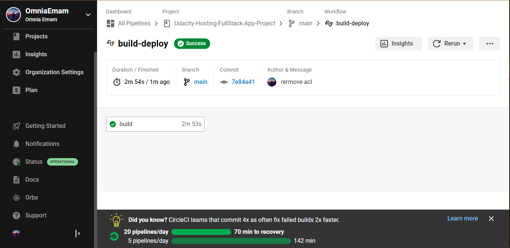
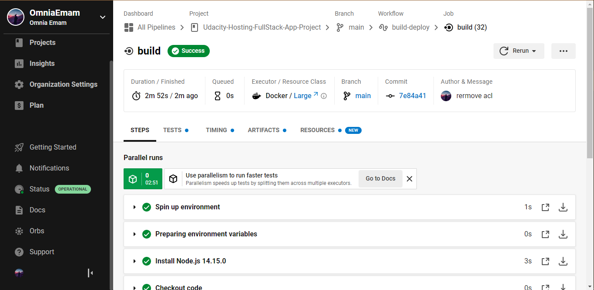
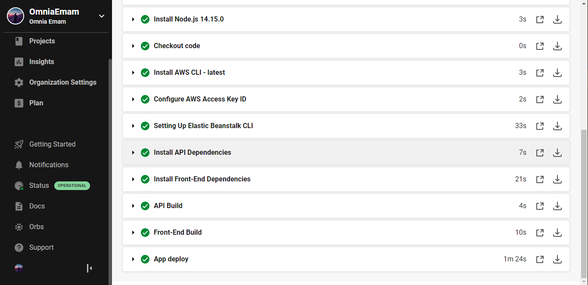
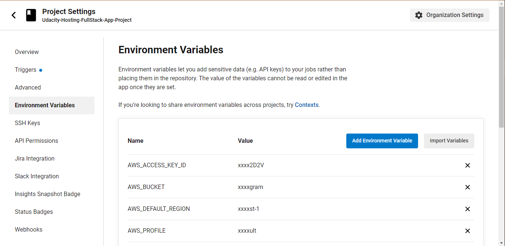
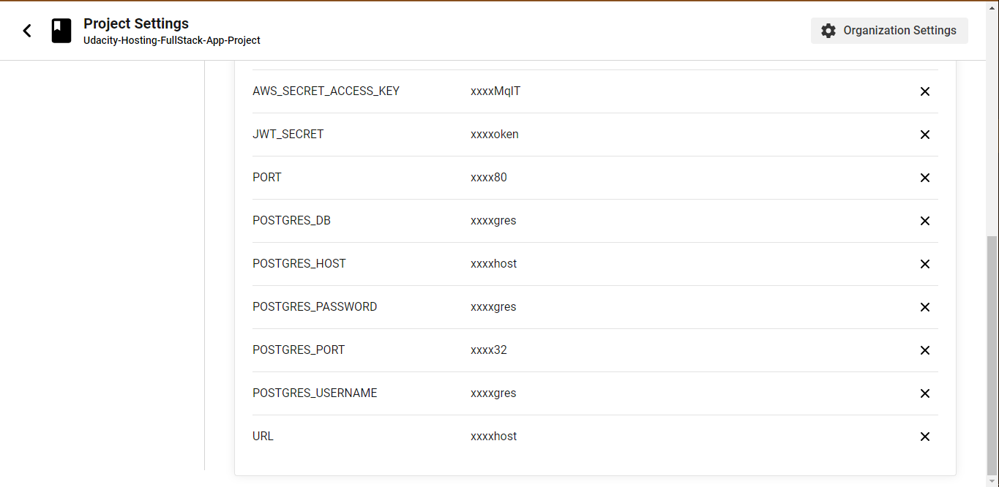

# Pipeline process

## **Okay in this file we will translate the PipelineDiagram diagram into actual steps**

---
### Now we discuss in Pipeline Diagram

## **FIRST : GITHUB**
---
### 1. Go to github , create repoitroy and push into it 

## **SECOND :CircleCi**
---
### 1.connect CircleCi with your GitHub and wait for the deployment process then fix any failed will face you

---
### 3.Add yours Environment Variable

